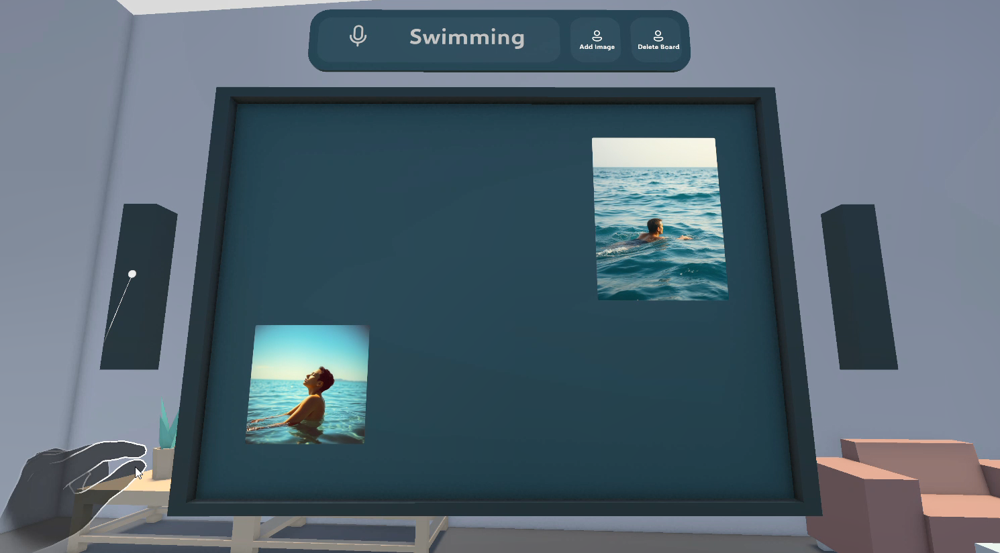
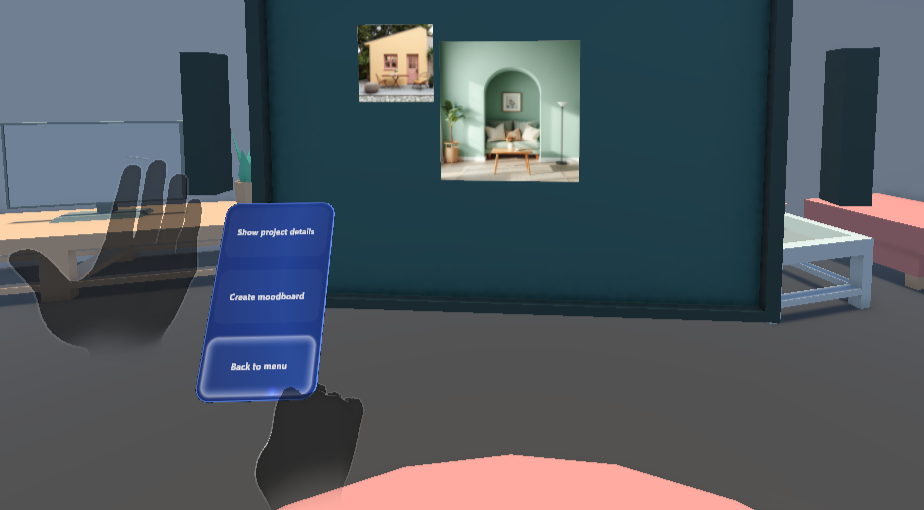
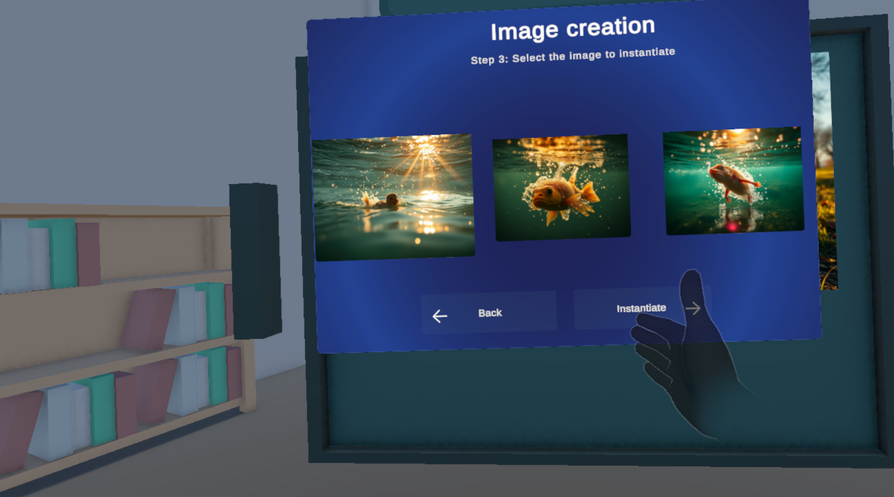
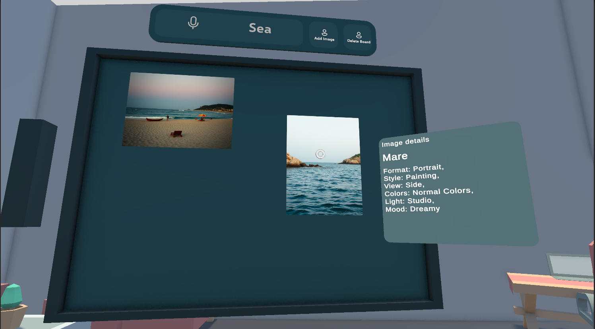

## 🎨 Project Overview

This project presents a **Virtual Reality (VR) moodboarding tool** with a multi-layered software architecture designed for **intuitive multimodal interaction**.  
It leverages a combination of modern development tools, open standards, and cloud services to deliver a flexible and high-performance immersive experience.

---

## ⚙️ Core Development Stack

The application is built with:

- **Unity** – lightweight and optimized for VR hardware performance.
- **OpenXR** – ensures cross-device compatibility and avoids vendor lock-in.
- **Mixed Reality Toolkit 3 (MRTK3)** – provides advanced hand tracking, a library of pre-built components, and an XR Simulator for in-editor testing.

---

## 🧩 Multimodal Interaction & UX Design

The system employs a **hybrid interaction model**:  
💡 *Virtual buttons + Gesture-driven interface*, guided by a **"Hand Tracking First"** philosophy.

Key UX principles:

- 🧱 **Skeuomorphism**: Real-world metaphors (e.g., corkboard).
- 🧠 **Gestalt Principles**: Organized layout to reduce cognitive load.
- ✨ **Progressive Disclosure**: On-demand UI elements to avoid clutter.

---

## ✋ Gesture-Driven Interface & Recognition

Custom gestures are central to the user experience. Designed through **research, prototyping, and user testing**, gestures are:

- **Learnable**, **memorable**, and **ergonomically sound**.
- Recognized using **XR Hands**, Unity’s official hand tracking system.

### 🎯 Gesture Categories

| 🔹 **Trigger Gestures**                | 🔹 **UI Navigation Gestures**         |
|--------------------------------------|--------------------------------------|
| **Start Mic** _(fingers to mouth)_ Begins vocal input   | **Thumbs Up**  Quick confirmation   |
| **Frame** _(hands form rectangle)_ Creates new moodboard/image   | **Swipe**  Directional navigation   |

## 🧠 AI-Based Image Generation

The system integrates **Diffusion models** via APIs like:

- 🧪 **Hugging Face**
- ⚡ **NScale**

### 🔀 Prompt Composition

Image prompts are built from:

1. 🎙️ **Vocal Input** – user’s creative idea
2. 🗒️ **Project Brief** – contextual info (tone, style)
3. 🎛️ **GUI Parameters** – lighting, color, aspect ratio

Multiple image candidates are generated per prompt to **reduce ambiguity** and increase creative control.

---

## 🧱 Software Architecture Patterns

Designed for **maintainability and scalability** using:

- 🔄 **Observer Pattern** – decouples event handling
- 🔀 **MVVM** – separates UI, logic, and data
- 🔒 **Singletons** – for core services (e.g., `SpeechToTextManager`)
- 🧩 **Image Generation Interface** – abstracts API backends for testing/production
- 👁️ **Gaze-Based Positioning** – recenters UI panels to user's FOV during scene changes

---

## 🧪 UX Prototyping & Workflow

The design process started with **Figma-based prototyping**, using:

- 🎨 **MRTK3 Figma Toolkit** – prebuilt components optimized for VR ergonomics
- 📐 Constraints like **field of view** and **reach zones** respected from early stages

### 📐 Comfort Zones

Although Figma is a 2D tool, the interface layout was designed to respect VR-specific constraints such as **field of view (FOV)**, **depth**, and **ergonomic reach**.  
The working canvas was set to **3664 × 1920 pixels**, simulating the combined resolution of the Meta Quest 2 headset (*1832 × 1920 pixels per eye*).

**Visibility and comfort zones** were calculated based on pixel-per-degree metrics from VR usability studies, and further informed by the Figma community resource *“Guide for Spatial Design of VR”*, adapted to match the optical properties of the Meta Quest 2.

#### Zones definition:

- 🟢 **Green Zone** (central clarity, ~50° FOV): **1000 × 1000 px**
- 🟡 **Yellow Zone** (peripheral area, ~50°–90°): **1600 × 1600 px**
- ⚪ **Gray Zone** (outside ~90°): areas discouraged for UI placement

#### Head movement comfort boundaries:

- 🔄 Horizontal neck rotation (±30°): **±1000 px**
- 🔼 Vertical head tilt (±20°): **±700 px**

### ➡️ Workflow:  
**Figma** → rapid iteration → **Unity** implementation → in-headset testing  
This ensured a final interface that is both **aesthetically polished** and **spatially ergonomic**.

### 📁 Project Selection Mockup with comfort boundaries

### 🧩 Moodboard Interface Mockup

---

## 🧪 Final Implementation in Unity

The following screenshots show the actual implementation of the system in Unity, translating the Figma-designed concepts into a working VR environment:

<table>
  <tr>
    <th>✋ Grabbing Board</th>
    <th>🖐️ Hand Menu</th>
  </tr>
  <tr>
    <td></td>
    <td></td>
  </tr>
  <tr>
    <th>🖼️ Image Creation</th>
    <th>🔎 Image Selection and Details</th>
  </tr>
  <tr>
    <td></td>
    <td></td>
  </tr>
</table>

These views highlight:

* 🧩 **Consistency with Figma layouts**
* 👐 **Fully functional gesture and button interactions**
* 🎯 **Refined user interface aligned with ergonomic constraints**

