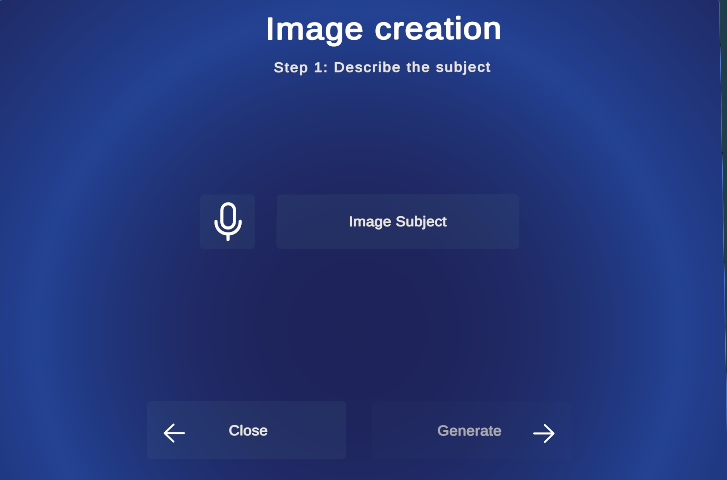
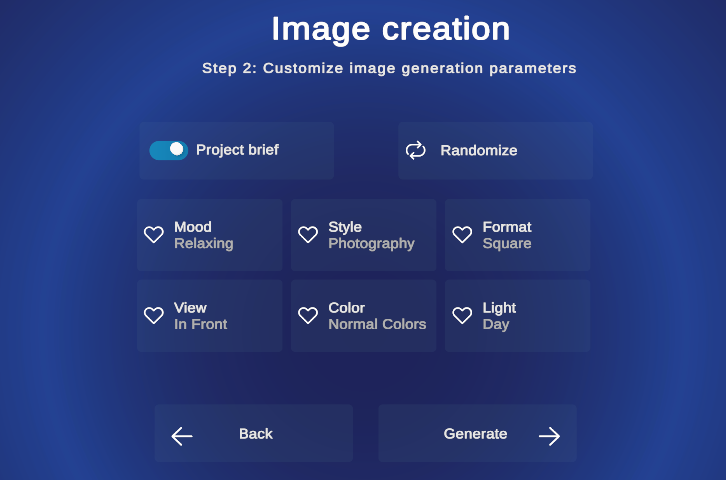
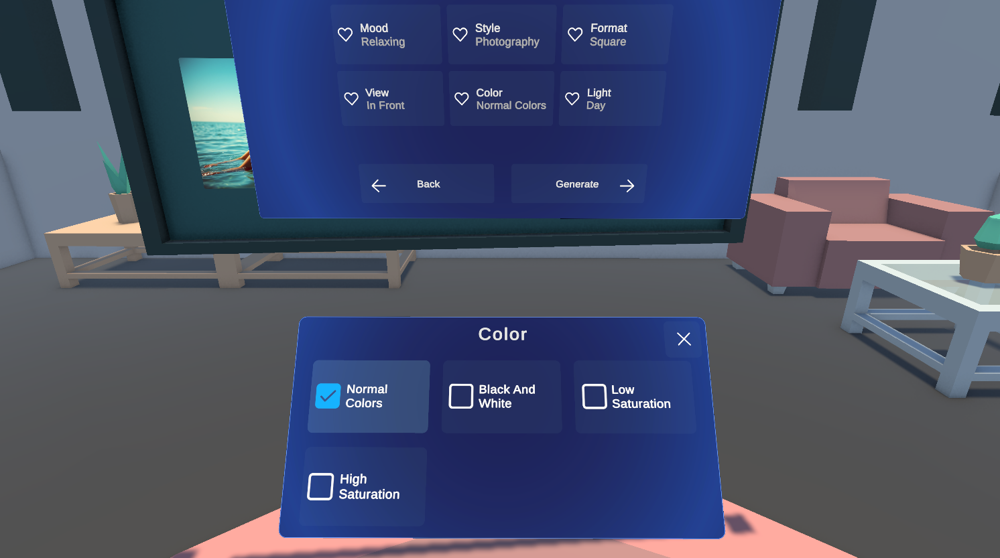
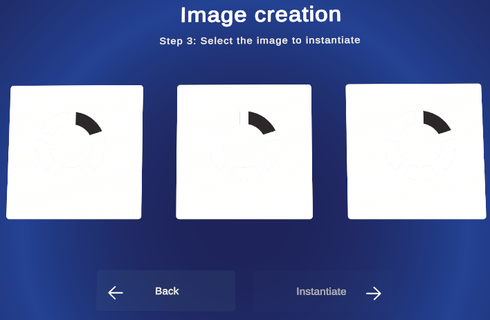

## 🎨 Project Overview

This project presents a **Virtual Reality (VR) moodboarding tool** with a multi-layered software architecture designed for **intuitive multimodal interaction**.
It leverages a combination of modern development tools, open standards, and cloud services to deliver a flexible and high-performance immersive experience.

---

## ⚙️ Core Development Stack

The application is built with:

* **Unity** – lightweight and optimized for VR hardware performance.
* **OpenXR** – ensures cross-device compatibility and avoids vendor lock-in.
* **Mixed Reality Toolkit 3 (MRTK3)** – provides advanced hand tracking, a library of pre-built components, and an XR Simulator for in-editor testing.

---

## 🧱 Software Architecture Patterns

Designed for **maintainability and scalability** using:

* 🔄 **Observer Pattern** – decouples event handling
* 🔀 **MVVM** – separates UI, logic, and data
* 🔒 **Singletons** – for core services (e.g., `SpeechToTextManager`)
* 🧩 **Image Generation Interface** – abstracts API backends for testing/production
* 👁️ **Gaze-Based Positioning** – recenters UI panels to user's FOV during scene changes
* ⚡ **Multithreading & Asynchronous Operations** – used to handle background tasks such as speech acquisition or AI-based image generation without blocking the main VR rendering thread.
  
---

## ✋ Gesture-Driven Interface & Recognition

Custom gestures are recognized using **XR Hands**, Unity’s official hand tracking system.

### 🎯 Gesture Categories

| 🔹 **Trigger Gestures**                                                                                                                     | 🔹 **UI Navigation Gestures**                                                                                 |
| ------------------------------------------------------------------------------------------------------------------------------------------- | ------------------------------------------------------------------------------------------------------------- |
| **Start Mic** *(fingers to mouth)* Begins vocal input                | **Thumbs Up**  Quick confirmation      |
| **Frame** *(hands form rectangle)* Creates new moodboard/image   | **Swipe**  Directional navigation   |

---

## 🧠 AI-Based Image Generation

The system integrates **Diffusion models** via APIs like:

* 🧪 **Hugging Face**
* ⚡ **NScale**
  
To have finer control over the image generation process and output quality, a Python script is used to interact with these APIs.
This script is invoked by Unity asynchronously, which requests image generation with the specified prompts.
Once the Python process completes, the generated images are loaded back into Unity as textures for display and further manipulation.

### 🔀 Prompt Composition

Image prompts are built from:

1. 🎙️ **Vocal Input** – user’s creative idea
2. 🗒️ **Project Brief** – contextual info (tone, style)
3. 🎛️ **GUI Parameters** – lighting, color, aspect ratio

Multiple image candidates are generated per prompt to **reduce ambiguity** and increase creative control.

Here is how the process appears within the app:

 <table> <tr> <td align="center"> <b>Image Subject Selection</b>   </td> <td align="center"> <b>Prompt Style Configuration</b>   </td> </tr> <tr> <td align="center"><b>Color and Lighting Selection</b>   </td> <td align="center"><b>Final Image Creation View</b>   </td> </tr> </table> 
