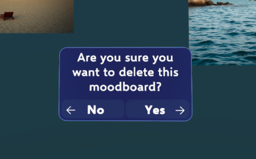

# 📈 Analysis of User Study Results

This section summarizes the key findings from a user study, focusing on the **effectiveness**, **usability**, and **user preferences** of different input modalities. The results are exclusively based on the provided images.

---

## 📋 Test Procedure

The test followed the procedure illustrated in the graph below. The study involved 21 participants.

  

## 📊 User Satisfaction and Workload

<table>
  <tr>
    <td align="center"> <b>SUS Score Distribution</b></td>
    <td align="center"> <b>NASA-TLX Workload</b></td>
  </tr>
</table>

* **SUS Score**: The "Hybrid" and "Traditional" input methods show similarly high usability. The "Gesture" method has a slightly lower median score and wider distribution, indicating mixed reception.
* **NASA-TLX**: Workload is relatively even across all input types. Gestures are slightly more demanding, but not significantly so.

---

## 🎯 User Preferences

<table>
  <tr>
    <td align="center"> <b>Favorite Interaction Mode</b></td>
    <td align="center"> <b>Most Natural Interaction Mode</b></td>
  </tr>
</table>

* **Favorite Mode**: The Hybrid mode is by far the most appreciated.
* **Naturalness**: Users also perceive the Hybrid mode as the most natural. The Gesture mode scores slightly better than Traditional on this aspect.

---

## ⏱️ Task Performance and Efficiency

  

* **Task Duration**: Tasks were completed fastest with the Hybrid mode. Gestures are slightly faster than Traditional, suggesting potential for efficiency when well-integrated.

---

## 👋 Gesture Evaluation

  

**Overall Ratings**
All gestures were positively received by users.

<table> <tr> <td align="center">  </td> <td align="center">  </td> </tr> <tr> <td> <ul> <li>🟥 <b>Frame</b></li> <li>Most physically demanding</li> <li>Clear and appreciated, but may cause fatigue over time</li> </ul> </td> <td> <ul> <li>🟩 <b>Start Mic</b></li> <li>One of the least intuitive gestures</li> <li>Often confused or requiring explanation</li> </ul> </td> </tr> <tr> <td align="center">  </td> <td align="center">  </td> </tr> <tr> <td> <ul> <li>🟪 <b>Swipe</b></li> <li>Slightly lower responsiveness</li> <li>Confirmed by lower preference scores</li> </ul> </td> <td> <ul> <li>🟦 <b>Thumbs-Up</b></li> <li>Highly intuitive and easy to perform</li> <li>Praised for simplicity and effectiveness</li> </ul> </td> </tr> </table>

---

## 🧠 Gesture vs Button Usage in Hybrid Mode

In hybrid mode, user preferences vary depending on the type of action and the spatial context.

  

* 👋 **Gestures** are preferred for *activating voice input* and *creating images* or *generating moodboards*.
* ⬤ **Buttons** are more frequently used for navigating UI elements, particularly when they appear close to the user.

This distinction becomes clearer when comparing input usage between *close* and *far* interaction windows.

---

## 🔄 Hybrid Mode Input Preferences for navigating UI elements

<table>
  <tr>
    <td align="center">
       
      <b>Example of Close Window</b>
    </td>
    <td align="center">
       
      <b>"Yes" (Close Window)</b>
    </td>
  </tr>
  <tr>
    <td align="center">
       
      <b>Example of Far Window</b>
    </td>
    <td align="center">
       
      <b>"Next" (Far Window)</b>
    </td>
  </tr>
</table>

* ✅ **"Yes" Action (Close Interaction)**:
  Button input is predominant. The Thumbs-Up gesture is used in only **\~20%** of cases, suggesting a preference for more precise input when the UI is near.

* ⏭️ **"Next" Action (Far Interaction)**:
  While button use remains high, **gesture use increases significantly**. The Thumbs-Up gesture reaches **\~40%**, reflecting a shift toward more natural input at a distance.

---
