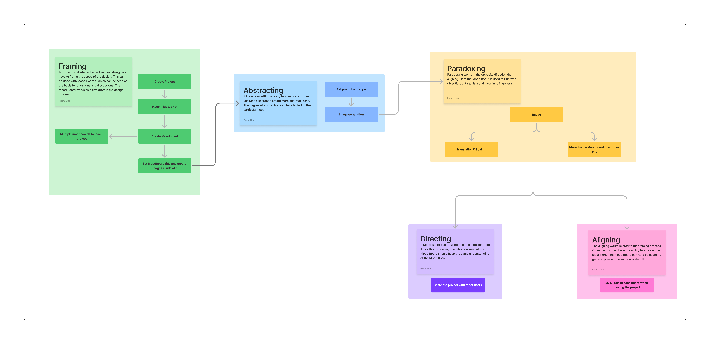
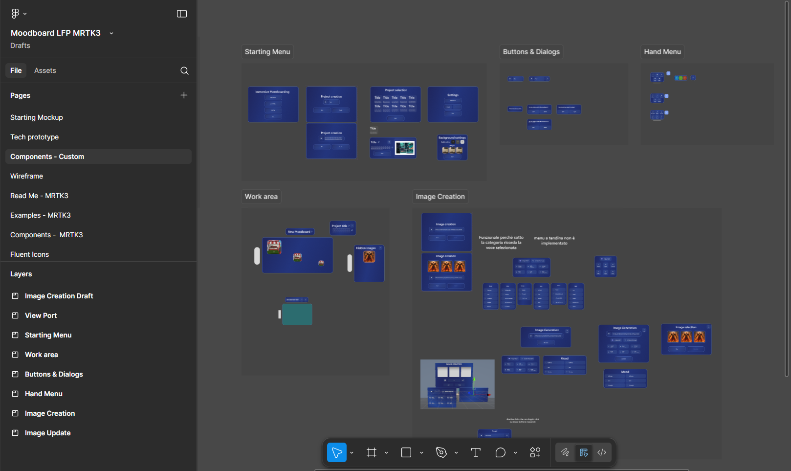
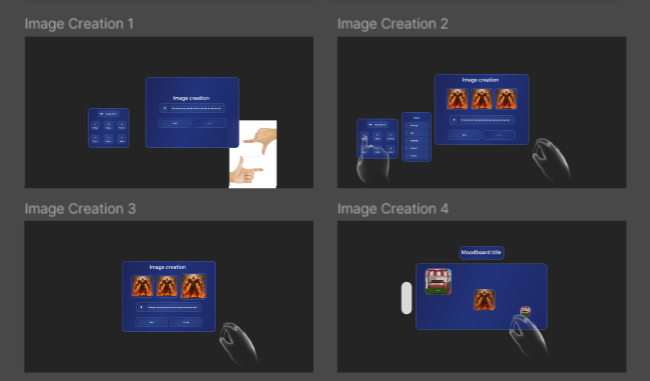

# 🎯 Project Overview (UX Focus)

This project’s user experience is centered on creating an **intuitive multimodal interaction** paradigm within a VR moodboarding environment. Guided by a **"Hand Tracking First"** philosophy, the design aims to enable natural, efficient, and enjoyable creative workflows in immersive space.

---

## 📚 Domain Study and Research

Before starting design, I dedicated two weeks to deeply understanding the moodboarding practice and its role within the broader design thinking process.
This phase informed the identification of:

* Key user goals
* Core objects and components needed
* Critical tasks the system should support

The following visual summarizes the app features grounded on this domain knowledge:

---

## 🧭 User Path & Visual Exploration

With the domain defined, I explored various interaction and visual design concepts to shape the app’s main components and user flow.
This exploratory phase helped crystallize:

* Essential UI screens
* Interaction sequences
* Navigation flows

The below diagram shows an early user path draft guiding further design:

---

## 🤹 Multimodal Interaction Model

Inspired by recent research on natural user interfaces that combine speech, hand tracking, and generative AI ([source1](https://dl.acm.org/doi/10.1007/s11042-023-14381-6), [source2](https://www.shs-conferences.org/articles/shsconf/abs/2024/14/shsconf_etltc2024_03003/shsconf_etltc2024_03003.html)), the app integrates a **hybrid interaction model** that blends:

* 💡 Virtual buttons for precise UI control
* ✋ Gesture-driven inputs for natural, fluid commands

---

## UX Design Principles & Gestural Interaction

The UX was crafted around key principles to maximize user comfort and effectiveness:

* 🧱 **Skeuomorphism:** leveraging real-world metaphors like corkboards to aid mental models
* 🧠 **Gestalt Principles:** structuring layouts to reduce cognitive load and improve comprehension
* ✨ **Progressive Disclosure:** presenting UI elements only as needed to prevent clutter

Gestures were **carefully researched, prototyped, and validated** to ensure they are:

* Learnable and memorable for diverse users
* Ergonomically sound to minimize fatigue and maximize precision

---

## 🛠️ UX Prototyping & Iterative Workflow

Design was developed iteratively starting with **Figma prototyping**, using:

* 🎨 MRTK3 Figma Toolkit components tailored for VR ergonomics
* 📐 Early constraints respecting field of view (FOV), reachability, and depth cues

This process ensured tight feedback loops from concept to functional prototype.

---

### 📏 Comfort Zones & Ergonomic Design

Despite Figma’s 2D nature, I carefully modeled interface elements respecting VR-specific ergonomic constraints, including:

* **Canvas size:** 3664 × 1920 px (matches Meta Quest 2 combined eye resolution)

* **Comfort zones:**

  * 🟢 Green Zone (\~50° FOV): optimal clarity and focus area (1000×1000 px)
  * 🟡 Yellow Zone (\~50°–90°): peripheral UI zone for awareness (1600×1600 px)
  * ⚪ Gray Zone (>90°): avoided for important UI

* **Head movement limits:**

  * 🔄 Horizontal neck rotation ±30° (\~±1000 px)
  * 🔼 Vertical head tilt ±20° (\~±700 px)

---

### 🔄 Iterative Design Workflow

The overall process followed a continuous cycle of:

**Figma design → Rapid iteration → Unity implementation → In-headset user testing → Feedback analysis → Refinement**

This approach fostered:

* Visual polish and consistency
* Spatial ergonomics in immersive 3D
* A smooth, natural interaction flow

---

### 🧩📖 Custom Components & Storyboarding

To streamline development and maintain design consistency, custom UI components were created in Figma alongside detailed interaction storyboards capturing key gestures and workflows:

  

---

### 🗂️🖼️ Key UI Screens: Project Selection & Moodboard

The main UI views were designed to respect comfort zones and ergonomic principles, ensuring ease of use and clarity:

  

---

### 🎬💻 Final Unity Implementation & UX Outcomes

The Unity build faithfully realizes the Figma vision, preserving:

* Consistent layouts and spatial arrangements
* Ergonomic placement of gestures and buttons
* Clean, clutter-free interaction flow

<table>
  <tr>
    <th>✋ Grabbing Board</th>
    <th>🖐️ Hand Menu</th>
  </tr>
  <tr>
    <td></td>
    <td></td>
  </tr>
  <tr>
    <th>🖼️ Image Creation</th>
    <th>🔎 Image Selection and Details</th>
  </tr>
  <tr>
    <td></td>
    <td></td>
  </tr>
</table>

